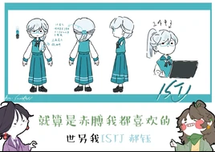

# 郝瑟（ISTJ）

<figure><figcaption>新版人物立绘</figcaption></figure>

<table class="wiki-infobox"><tr><th>简介</th><td>实际且注重事实的个人，可靠性不容怀疑。</td></tr><tr><th>配音</th><td>无/承锦（男，偶尔出场）</td></tr><tr><th>原名</th><td>物流师</td></tr><tr><th>花名</th><td>机器人、蓝老头</td></tr></table>

郝瑟（ISTJ，名字来源于绰号“瑟瑟老头”、谐音“好色”。性转名：郝钰，谐音“好欲”）

原名：物流师

外号：机器人、蓝老头<small>（2025年7月25日新增）</small>

[王维诗里的MBTI](../channel.md)频道的主要角色之一。

该角色男女性别之间为兄妹关系。

*<small>————“浪漫也可以是湖畔不舍得驶离的船。”</small>*<small>（2025年7月25日新增）</small>

## 心流功能（根据毕比模型）

第一功能（主导功能/英雄）：Si（内向实感）

第二功能（辅助功能/父母）：Te（外向思考）

第三功能（少年功能/永恒少年）：Fi（内向情感）

第四功能（劣势功能/阿尼玛or阿尼姆斯）：Ne（外向直觉）

第五功能（对手功能/对立人格）：Se（外向实感）

第六功能（批判功能/长老or女巫）：Ti（内向思考）

第七功能（盲点功能/小丑）：Fe（外向情感）

第八功能（魔鬼功能/恶魔）：Ni（内向直觉）

## 彩蛋&冷知识

- ISTJ之所以被命名为“郝瑟”是因为王元元对16personalities的ISTJ角色设计有“长得好色”的印象。
- 郝瑟和郝钰是唯一不经常采用配音演员，绝大部分时间采用AI配音的角色。<small>（配音演员为承锦（男版））</small>
- 郝瑟和郝钰在日常或者“当机”时会发出电脑系统声音，符合了人们对ISTJ是“人机”的刻板印象。
- 旧版立绘郝钰的职位是一名警员。

## 图库

<figure><figcaption>QQ20250728-023541.png</figcaption></figure><figure><figcaption>QQ20250704-200906.png</figcaption></figure><figure><figcaption>QQ20260130-205938.png</figcaption></figure><figure><figcaption>QQ截图20240228003316.png</figcaption></figure><figure><figcaption>QQ截图20240228003347.png</figcaption></figure><figure><figcaption>QQ截图20240228003450.png</figcaption></figure><figure><figcaption>QQ截图20240228003610.png</figcaption></figure>

