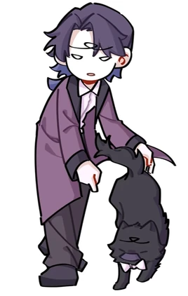
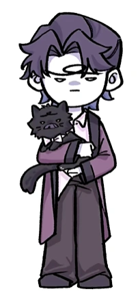
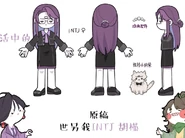
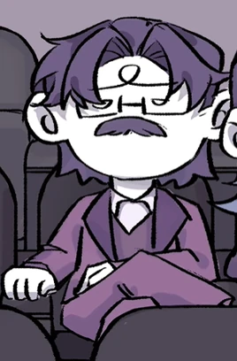
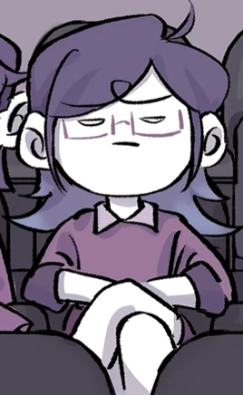

# 胡紫（INTJ）

<figure><figcaption>新版人物立绘</figcaption></figure>

<table class="wiki-infobox"><tr><th>简介</th><td>富有想象力和战略性的思想家，一切皆在计划之中。</td></tr><tr><th>配音</th><td>男：黑狗；女：冥河</td></tr><tr><th>原名</th><td>建筑师</td></tr><tr><th>花名</th><td>禁欲老头、紫老头、紫薯、胡子</td></tr></table>

胡紫（INTJ，名称来源于谐音“胡子”）

原名：建筑师

外号：禁欲老头、紫老头、紫薯、胡子<small>（2025年7月25日新增）</small>

[王维诗里的MBTI](../channel.md)频道的主要角色之一。

<small>*————山风吹来，竟真的明晰了一切*（2025年7月25日新增）</small>

## 心流功能（根据毕比模型）

第一功能（主导功能/英雄）：Ni（内向直觉）

第二功能（辅助功能/父母）：Te（外向思考）

第三功能（少年功能/永恒少年）：Fi（内向情感）

第四功能（劣势功能/阿尼玛or阿尼姆斯）：Se（外向实感）

第五功能（对手功能/对立人格）：Ne（外向直觉）

第六功能（批判功能/长老or女巫）：Ti（内向思考）

第七功能（盲点功能/小丑）：Fe（外向情感）

第八功能（魔鬼功能/恶魔）：Si（内向实感）

## 彩蛋&冷知识

- 胡紫是唯一有专属宠物的角色（名为“小胡子”的猫咪）
- 旧版本角色是有胡子，但由于网友投票显示80%不赞成保留胡子，所以新版本角色设计中决定把胡子转移去宠物猫。

## 图库

<figure><figcaption>QQ20250728-023429.png</figcaption></figure><figure><figcaption>QQ20260130-205543.png</figcaption></figure><figure><figcaption>QQ截图20240228014418.png</figcaption></figure><figure><figcaption>QQ20250704-200620.png</figcaption></figure><figure><figcaption>QQ截图20240228014540.png</figcaption></figure><figure><figcaption>QQ截图20240228014509.png</figcaption></figure>

