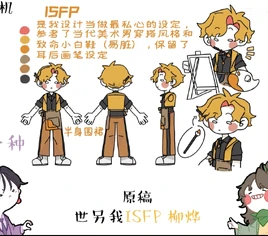

# 柳怜（ISFP）

<figure><figcaption>新版人物立绘</figcaption></figure>

<table class="wiki-infobox"><tr><th>简介</th><td>灵活有魅力的艺术家，时刻准备着探索和体验新鲜事物。</td></tr><tr><th>配音</th><td>男：适燃；女：冷静</td></tr><tr><th>原名</th><td>探险家</td></tr><tr><th>花名</th><td>小画家、榴莲头</td></tr></table>

柳怜（ISFP，名字来源于花名“榴莲头”谐音。性转名：柳烨）

原名：探险家

外号：小画家、榴莲头<small>（2025年7月25日新增）</small>

[王维诗里的MBTI](../channel.md)频道的主要角色之一。

*<small>————“这张纸我留了空白，想和你一起填上刚采的小花”。</small>*<small>（2025年7月25日新增）</small>

## 心流功能（根据毕比模型）

第一功能（主导功能/英雄）：Fi（内向情感）

第二功能（辅助功能/父母）：Se（外向实感）

第三功能（少年功能/永恒少年）：Ni（内向直觉）

第四功能（劣势功能/阿尼玛or阿尼姆斯）：Te（外向思考）

第五功能（对手功能/对立人格）：Fe（外向情感）

第六功能（批判功能/长老or女巫）：Si（内向实感）

第七功能（盲点功能/小丑）：Ne（外向直觉）

第八功能（魔鬼功能/恶魔）：Ti（内向思考）

## 喜欢和不喜欢的东西

喜欢：重生文

## 彩蛋&冷知识

- 柳怜对着朋友讲昧心话的时候是不敢直视的
- 柳怜生气时会变成烧水壶音（？）
- 在之前的视频中柳怜扮演过鬼（不吓人），其中在《16人格当创世神》一集有一场景中马麻（ISFJ）下凡看恐怖电影的角色为柳怜时验证了这个说法。（存疑，待考证）

## 图库

<figure><figcaption>QQ20250728-023902.png</figcaption></figure><figure><figcaption>QQ20260130-210320.png</figcaption></figure><figure><figcaption>QQ20250704-200844.png</figcaption></figure><figure><figcaption>QQ截图20240227182529.png</figcaption></figure><figure><figcaption>QQ截图20240227174421.png</figcaption></figure><figure><figcaption>QQ截图20240227174345.png</figcaption></figure><figure><figcaption>QQ截图20240227174607.png</figcaption></figure>

