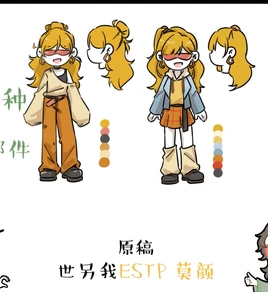
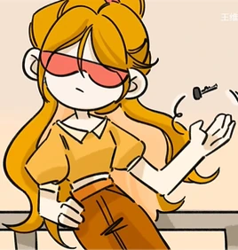

# 莫竞（ESTP）

<figure><figcaption>新版人物立绘</figcaption></figure>

<table class="wiki-infobox"><tr><th>简介</th><td>聪明，精力充沛善于感知的人们，真心享受生活在边缘。</td></tr><tr><th>配音</th><td>男：凹林；女：柳知萧</td></tr><tr><th>原名</th><td>企业家</td></tr><tr><th>花名</th><td>墨镜、盲人</td></tr></table>

莫竞（ESTP，名字来源于谐音“墨镜”；女性为“莫颜”，谐音“墨眼”）

原名：企业家

外号：墨镜、盲人<small>（2025年7月25日新增）</small>

[王维诗里的MBTI](../channel.md)频道的主要角色之一。

*<small>————我们马上就要乘风起了。</small>*<small>（2025年7月25日新增）（关于这里的“乘风起”是否打漏字，尚不清楚）</small>

## 心流功能（根据毕比模型）

第一功能（主导功能/英雄）：Se（外向实感）

第二功能（辅助功能/父母）：Ti（内向思考）

第三功能（少年功能/永恒少年）：Fe（外向情感）

第四功能（劣势功能/阿尼玛or阿尼姆斯）：Ni（内向直觉）

第五功能（对手功能/对立人格）：Si（内向实感）

第六功能（批判功能/长老or女巫）：Te（外向思考）

第七功能（盲点功能/小丑）：Fi（内向情感）

第八功能（魔鬼功能/恶魔）：Ne（外向直觉）

## 彩蛋&冷知识

- 莫竞摘下墨镜时显示了他的33眼，极大可能是近视眼（校园版和《不器》版中莫竞是佩戴者眼镜或者变色眼镜）。
- 莫竞的眼瞳色是蓝色。
- 莫竞的车牌号是“牛BXX6”（在《16型人格emo的表现》一集），初期是“ESTP”。

## 图库

<figure><figcaption>QQ20250728-023506.png</figcaption></figure><figure><figcaption>QQ20260130-210028.png</figcaption></figure><figure><figcaption>QQ20250704-200427.png</figcaption></figure><figure><figcaption>QQ截图20240315050803.png</figcaption></figure><figure><figcaption>QQ截图20240227190146.png</figcaption></figure><figure><figcaption>QQ截图20240227190213.png</figcaption></figure><figure><figcaption>QQ截图20240227190422.png</figcaption></figure><figure><figcaption>QQ截图20240227192050.png</figcaption></figure>

