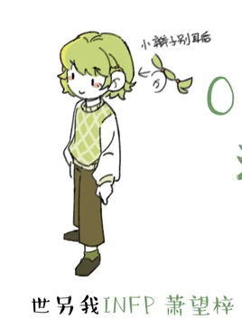
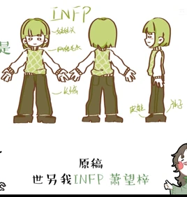

# 萧福叠（INFP）

<figure><figcaption>新版人物立绘</figcaption></figure>

<table class="wiki-infobox"><tr><th>简介</th><td>诗意，善良的利他主义者，总是热情地为正当理由提供帮助。</td></tr><tr><th>配音</th><td>男：恶霸；女：云中鹿饮溪</td></tr><tr><th>原名</th><td>调停者</td></tr><tr><th>花名</th><td>小蝴蝶、恁蝶、流泪猫猫头</td></tr></table>

萧福叠（INFP，名字来源于谐音“小蝴蝶”；男性为“萧望梓”，谐音“小王子”）

原名：调停者

外号：小蝴蝶、恁碟、流泪猫猫头<small>（2025年7月25日新增）</small>

[王维诗里的MBTI](../channel.md)频道的主要角色之一。

*<small>————最孤独的岛屿，也会被潮汐反复拥抱。</small>*<small>（2025年7月25日新增）</small>

## 心流功能（根据毕比模型）

第一功能（主导功能/英雄）：Fi（内向情感）

第二功能（辅助功能/父母）：Ne（外向直觉）

第三功能（少年功能/永恒少年）：Si（内向实感）

第四功能（劣势功能/阿尼玛or阿尼姆斯）：Te（外向思考）

第五功能（对手功能/对立人格）：Fe（外向情感）

第六功能（批判功能/长老or女巫）：Ni（内向直觉）

第七功能（盲点功能/小丑）：Se（外向实感）

第八功能（魔鬼功能/恶魔）：Ti（内向思考）

## 彩蛋&冷知识

- 萧福叠的发型长度说明了她进入或者离开了某段关系（无论友情、亲情还是爱情），比如失恋时会把头发剪短。发色是柳怜（ISFP）严选的。
- 在《谁在撒谎？我的真相笔记》书籍里，萧福叠的另一个名字是“雅纳”。

## 图库

<figure><figcaption>QQ20250704-201009.png</figcaption></figure><figure><figcaption>QQ20250704-201026.png</figcaption></figure><figure><figcaption>QQ20260130-205348.png</figcaption></figure><figure><figcaption>QQ20250728-023148.png</figcaption></figure><figure><figcaption>QQ截图20240228030402.png</figcaption></figure><figure><figcaption>QQ截图20240228030436.png</figcaption></figure><figure><figcaption>QQ截图20240228030608.png</figcaption></figure><figure><figcaption>QQ截图20240228030643.png</figcaption></figure>

